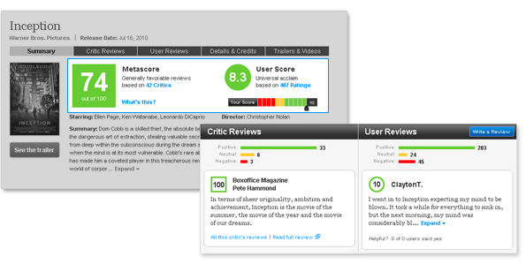

# Movie Box-office prediction based on early critic vote

The goal of this project is to predict the box-office of movies based on the rating from popular websites such as IMDB, Rotten Tomatoes and Metacritics. IMDB voting is only done by users of the website who are regular movie viewers. Metacritics votes are done solely by critics and only normal users can see the rating. Rotten Tomatoes on the other hand has two rating systems; one for critics which is called Tomatometer and one for normal users which is called an audience score. First, I made a model using data to see how a combination of these votes can predict the box office and to further see different impacts of each type of voting (Audience and Critics) on the box-office prediction.

## 1.Data
The data set for this project consists of 3312 rating sets of movies. This dataset was gathered from 4 different sources:

•	Box office mojo website which provides data about the box-office of movies. Data was manually scraped from the website using Beautiful Soup library.
[Mojo data scraped](https://github.com/AminKafka/Movie_boxoffice_reviews/blob/main/notebooks/data_gathering.ipynb)

•	IMDB which can be found on Kaggle and consists of average vote, male vote, female vote, US vote and non-US vote accompanied by how many people voted for the movie.

•	Rotten Tomatoes which is also found on Kaggle. This set has both a value for critic vote and audience vote.
[Rotten Tomato Dataset](https://www.kaggle.com/stefanoleone992/rotten-tomatoes-movies-and-critic-reviews-dataset?select=rotten_tomatoes_movies.csv)

•	Metacritic which was scraped manually from the website and consists of critics and audience vote average and vote counts.
[Metacritic data scraped](https://github.com/AminKafka/Movie_boxoffice_reviews/blob/main/notebooks/meta_scrap.ipynb)

## 2.Method

Predicting a box-office number is a supervised regression task. Features in the dataset consist of votes average and the number of critics/audience who voted. These features will be used as a predictor. Movie box-office will be the dependent variable. 

In the first step, I used all the features (including the early critics vote and audience votes that were gathered after the release of the movie and over time) as a predictor, to see how efficiently they can be used for the prediction purpose. I also attempt to see how the diffrent regression model performed by using this data and pick the best model based on Mean absolute error.

Next I will attempt to make a separate model, by only using the critic early votes information to see if we can have a prediction for the movie box-office before the movie release.

## 3.EDA

[EDA Report](https://github.com/AminKafka/Movie_boxoffice_reviews/blob/main/notebooks/EDA.ipynb)

* **Movie box-office** *

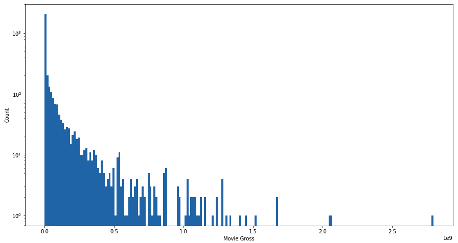

It is clear that the box-office variable has a range between 10,000 to 2,000,000,000 and visibily it is not a continuous value. This makes the prediction task which is based on the regression model, very hard and inacuurate. The dependrnt value in the regression model needs to be a continuous number in order to train the model for all possible senarios to therefore have a accurate predicition. with this, I can already imagine that the model won't create a very accurate box-office prediction.

I decided to classify the movie box-office in three different classes. Blockbuster, average and Indie label created for each movie based on its box-office. This way ,in addition to obtaining a possible prediction for box-office, I can use my regression model, to predict which class movie will end up in. Based on early critic votes, the movie are going to be a Blockbuster or average movie, or its going to sells less than 25 millions and classify as an Indie movie.

* **predictor values:Votes Data**

As the only predictor values, votes data consist of vote average and number of vote that are gathered by the website. It is 18 columns gathered from three diffrent different websites, Metacritics, Rotten Tomatoes and IMDB. For the final goal of this project I only use the critics early vote columns from Metacritic and Rotten Tomatoes. All the 18 columns on other hand will used to see the general performance of a model that consists of the vote information.

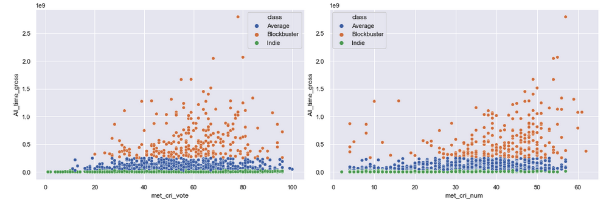

For the Metacritics it is clear that vote number show more linear correlation with the box-office data. All three different classes also have a balanced distribution both in vote average and vote number.

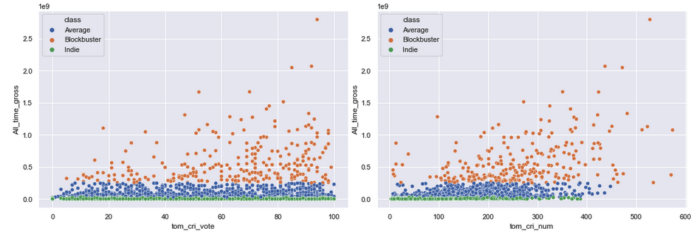

The Rotten tomato critics vote number scatter plot has even more linearity in comparison to Metacritics and I can assume that these columns will have the most importance in the prediction model.

Just by taking a glance at the audience number, it is obvious that this has more correlation with the box-office. The audience vote gathered after the release of the movie and as the movie's popularity increase among the audience, they tend to vote higher. Therefore, I can also assume here that the model which only consist of the critics votes will perform worse than the model that used the combination of the audience and critics vote.

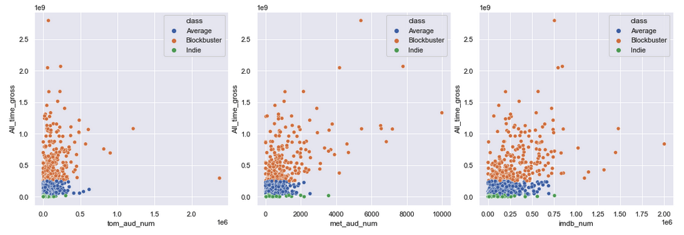

## 4. Algorithms & Machine Learning

[Pre-processing and Model Selection](https://github.com/AminKafka/Movie_boxoffice_reviews/blob/main/notebooks/Pre-processing.ipynb)

I chose to work with the Python [scikit-learn](https://scikit-learn.org/stable/) for training my recommendation model. I tested all four different algorithms on the full votes dataset, and the Random Forest Regressor algorithm performed the best. It should be noted that this algorithm, although the most accurate is also the most computationally expensive, and that should be taken into account if this were to go into production.

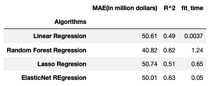

>***NOTE:** I choose MAE as the accuracy metric over RMSE because it's more robust against the outliner. Box-office data which is the dependent value, has lots of Blockbuster movies with the values over one billion dollars as the outlier and MAE performe better as a metric in this case. The smaller the MAE, the more accurate the prediction.*

**WINNER: Random Forest Regressor**

This algorithm clearly performed better in comapre to others. By using the GridSearch I chose the hyperparameters for best performance. 

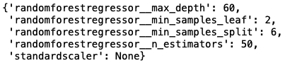

By looking at the features importance, we can see that my prediction about the audience being the most important factor one was true. Also as I assume the Rotten Tomato criticts vote number has the most weight amoung the critics vote information.

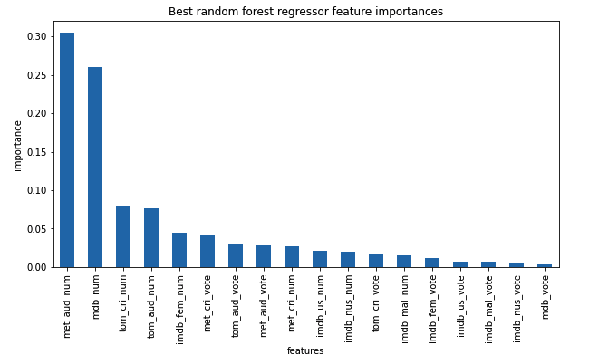

## 5. Modeling

[Modeling](https://github.com/AminKafka/Movie_boxoffice_reviews/blob/main/notebooks/Modeling.ipynb)

I chose the  Random Forest Regressor with the hyperparameters that I calculated in the previous step, as my final model. For the goal of the project I traine this model only on critics early vote information. Rotten Tomato vote number still plays the most important role in this model and has more than 60% weight of the model performance. Each movie that recieved more votes on this website from critics, regardless of what the actual vote was, will perform better in box-office according to this model.

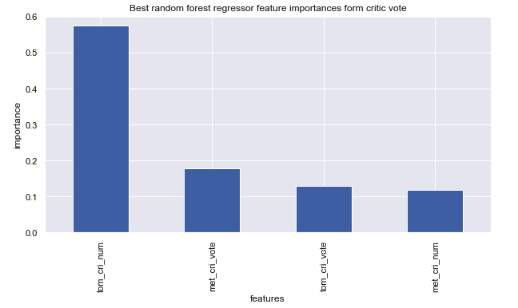

To see how this model performe, I calculate a metric by using the absolute error of the prediction and the actual box-office of each film and called it prediction accuracy. This metric range between 5% to 45% and it is almost the same for different classes of the movies. So by using the early vote of the critics I can predict the box-office of the film by 5 to 45 percent accuracy. This number is low mostly because of the nature of the box-office as a large range of discontinious values.

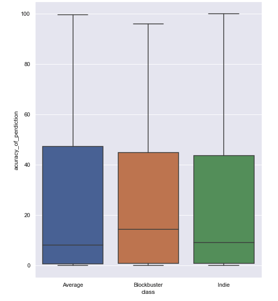

By using this model I can predict which class the movie will end up in. Especially for the Indie class, by looking at the critics early vote I can assume with good certainty that the movie is going to end up in this class, or be a average/Blockbuster movie.

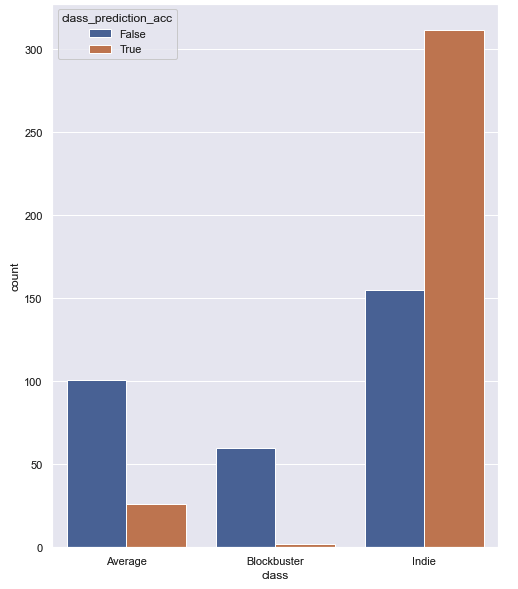

## 6. Getting the prediction for 2021 movie

For further investigation and see how this model works with the more recent data, I will pick three movies, one from each class and see how the early critics vote can predicts the box-office of that movie and will the model be able to pick a right class for the movie or not.

* **Dune**

Using the early critics votes of this movie, my model *predicts that Dune will collect 966 Million dollars* at box-office. This movie *in reality ends up with only 400 million dollars*. Because the critics love this film and vote more for it, we saw higher than what the film actually made in box-office. While the MAE is large but the model perdict currectly that Dune will be a Blockbuster movie.

* **House of Gucci**

Despite the fact that this movie directed by Ridly Scott and has a very well-known and popular stars such as Al Pacino and Lady GaGa, it only gahterd 100 million dollars in box-office. Peopel simply don't like it, or because of pandamic restriction people still hesitated to go back to teathers. But critics vote high for this film, and that is why my model predict 450 million dollars box-office for this film. Not only it is not close to the real number. it also perdict the wrong class for the film, only because critics like it more than audience.

* **Bergman Island**

This is the movie that adored by critics in festivals and on average got more than 90% possitive vote. But outside of the festiveals, did not get enough attention and that is why it does not have a high number of votes even among the critics. That is why my model predict that this movie will only sells 2 million dollars in box-office and in reality Bergman Island ends up with only 700 thousend dollars. So my model currectly perdict the class and also guess very close number for the real box-office.

## 7. Future Improvements

 * Predicting a box-office for a movie is hard task. While early critcs vote showed to be a decent factor in this prediction, but it is not enough for having a very accurate prediction. If I manage to gather more information like, how many time people google the name of the film in first week of movie release, or how many time people tweet about the film or even know the advertisment budget of the movie, I definitly can make a more accurate model for box-office prediction.

 * Beside these three website there are others that critics submite thier vote there. Although these are the most popular one but more data will help the perdiciton for sure.

 * The data I gathered was for years between 2010 and 2019 and only have 3000 rows. If I be able to gathered more data for all years avalable on those website and be able to merge them currectly together, my model would have a better performance.
